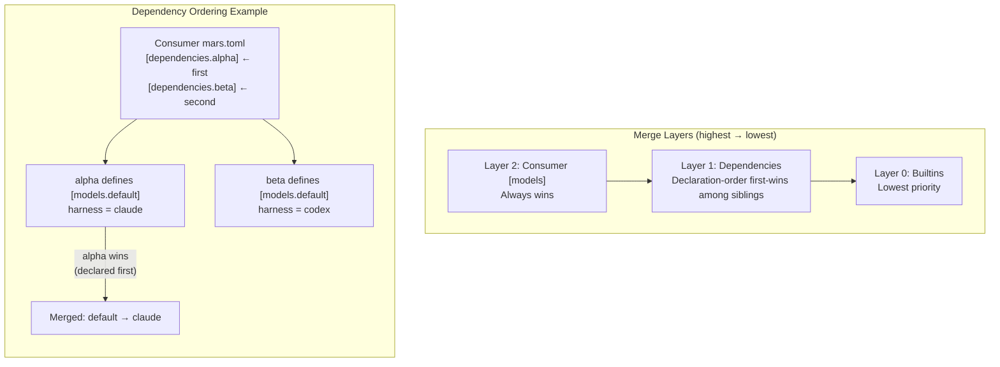

# Configuration Reference

## Terminology

- **Project root**: directory containing `mars.toml` and `mars.lock`.
- **Managed root**: directory Mars installs into (default: `.agents/`, configurable via `settings.managed_root`).
- **`--root`**: points to the managed root when you need to override auto-detection.

Mars uses three config files, all at the project root:

| File | Purpose | Committed? |
|---|---|---|
| `mars.toml` | Dependencies, filters, settings | Yes |
| `mars.lock` | Resolved versions, checksums, ownership | Yes |
| `mars.local.toml` | Developer-local overrides | No (gitignored) |

## `mars.toml`

### `[package]` (optional)

Present only in source packages (repos that others depend on). Consumers don't need this section.

```toml
[package]
name = "meridian-base"
version = "1.2.0"
description = "Core agents and skills for meridian"  # optional
```

| Field | Type | Required | Description |
|---|---|---|---|
| `name` | string | yes | Package name, used for dependency resolution |
| `version` | string | yes | Semver version of this package |
| `description` | string | no | Human-readable description |

### `[dependencies]`

Each key is the dependency name (the identifier Mars commands use). Each value specifies the source and optional filters.

`mars add` derives the dependency name from the source specifier by default. Example: `mars add meridian-flow/meridian-base` creates `[dependencies.meridian-base]`.

```toml
[dependencies.base]
url = "https://github.com/meridian-flow/meridian-base"
version = "^1.0"

[dependencies.dev]
path = "../my-dev-agents"

[dependencies.ops]
url = "https://github.com/acme/ops-agents"
agents = ["deployer", "monitor"]
skills = ["deploy-flow"]

[dependencies.toolkit]
url = "https://github.com/acme/toolkit"
only_skills = true
```

Commands such as `mars remove`, `mars override`, `mars upgrade`, and `mars why` take dependency names, not source URLs. Use `mars list --status` to see the `SOURCE` column and `mars list --source <name>` to filter by one dependency.

#### Source fields

Each dependency must have exactly one of `url` or `path` (not both, not neither).

| Field | Type | Description |
|---|---|---|
| `url` | string | Git URL (HTTPS, SSH, or GitHub shorthand expanded to HTTPS) |
| `path` | string | Local filesystem path (relative to project root or absolute) |
| `subpath` | string | Optional package root under the fetched repo or local path |
| `version` | string | Version constraint for git sources (see [Version Constraints](#version-constraints)) |

`subpath` is the explicit escape hatch for monorepo packages. When omitted, Mars discovers from the source root itself.

Supported source forms in v1:
- GitHub shorthand, `github:` aliases, repo URLs, and tree URLs
- GitLab `gitlab:` aliases, repo URLs, and tree URLs, including subgroup and custom-host forms
- Generic git SSH or `git://` URLs
- Local filesystem paths

Explicitly unsupported in v1:
- archive-download URLs such as `.zip`, `.tar.gz`, or similar
- direct file-download URLs such as `raw` or individual `SKILL.md` links

#### Filter fields

Filters control which agents and skills from a source are installed. Only one filter mode is active at a time.

| Field | Type | Description |
|---|---|---|
| `agents` | string[] | Install only these named agents (include mode) |
| `skills` | string[] | Install only these named skills (include mode) |
| `exclude` | string[] | Install everything except these named items |
| `only_skills` | bool | Install only skills, no agents |
| `only_agents` | bool | Install only agents plus their transitive skill dependencies (skills those agents declare and therefore require) |
| `rename` | table | Rename mappings (see [Renaming](#renaming)) |

#### Filter mode rules

These combinations are **rejected** at config load and CLI parse time:

| Combination | Reason |
|---|---|
| `only_skills` + `only_agents` | Mutually exclusive |
| `only_skills` + `agents` | Category-only conflicts with include list |
| `only_agents` + `skills` | Category-only conflicts with include list |
| `exclude` + `agents`/`skills` | Can't include and exclude simultaneously |
| `exclude` + `only_skills`/`only_agents` | Can't exclude and restrict category |

When no filter fields are set, all agents and skills from the source are installed (**All** mode).

#### Include mode behavior

When `agents` and/or `skills` lists are provided:

- Only named agents and named skills are installed
- If a named agent's **frontmatter** (the YAML metadata block at the top of the Markdown file) declares skill dependencies, those transitive skills are also installed automatically
- Items not found in the source are silently absent (warning at sync time)

#### `only_agents` behavior

- All agents from the source are installed
- Skills referenced by those agents' frontmatter are installed (**transitive skill dependencies**: indirectly required skills pulled in through agent declarations)
- Standalone skills not referenced by any agent are excluded

### `[settings]`

```toml
[settings]
managed_root = ".claude"   # default: ".agents"
links = [".claude", ".cursor"]

[settings.model_visibility]
include = ["opus*", "sonnet*"]  # or use exclude = [...]
```

| Field | Type | Default | Description |
|---|---|---|---|
| `managed_root` | string | `".agents"` | Directory name for managed output under the project root |
| `targets` | string[] | `[managed_root]` | Directories where managed content is copied |
| `model_visibility` | table | `{}` | Consumer-only display filter for `mars models list` output |

#### `[settings.model_visibility]`

Controls alias visibility in `mars models list`.

| Field | Type | Description |
|---|---|---|
| `include` | string[] | Glob patterns; only matching aliases are shown |
| `exclude` | string[] | Glob patterns; matching aliases are hidden |

Rules:
- `include` and `exclude` are mutually exclusive (`[settings.model_visibility]` with both is a validation error)
- Consumer-only setting; it does not flow through dependencies
- Display filter only; it does not affect `mars models resolve`
- CLI `mars models list --include/--exclude` overrides this config for that invocation

## Version Constraints

Mars uses [semver](https://semver.org/) for version resolution. Sources tag releases with `v`-prefixed semver tags (e.g., `v1.2.3`).

| Constraint | Meaning | Example |
|---|---|---|
| `^1.0` | Compatible with 1.x (>=1.0.0, <2.0.0) | `version = "^1.0"` |
| `~1.2` | Patch-level changes only (>=1.2.0, <1.3.0) | `version = "~1.2"` |
| `>=0.5.0` | At least this version | `version = ">=0.5.0"` |
| `=1.2.3` | Exact version | `version = "=1.2.3"` |
| `v1.2.3` | Exact version (v-prefix) | `version = "v1.2.3"` |
| *(omitted)* | Latest available (HEAD for untagged repos) | |

Branch or commit pins (non-semver strings) bypass version resolution entirely and fetch the specified ref directly.

## Renaming

Rename mappings let you change the installed name of an item from a source. This is useful for resolving naming collisions or for preferring shorter names.

Renames are set via `mars rename` (which updates the dependency's `rename` field) or by editing `mars.toml` directly:

```toml
[dependencies.base]
url = "https://github.com/meridian-flow/meridian-base"
rename = { "agents/coder__meridian-flow_meridian-base.md" = "agents/coder.md" }
```

## `[models]`

Model aliases map short names (e.g. `opus`, `sonnet`) to concrete model IDs or resolution patterns. Packages distribute aliases in their `mars.toml` under `[models]`; consumers can define their own to override or supplement.

```toml
# Pinned — explicit model ID
[models.opus]
harness = "claude"
model = "claude-opus-4-6"

# Auto-resolve — pattern matching against cached model catalog
[models.sonnet]
harness = "claude"
provider = "Anthropic"
match = ["sonnet"]
exclude = ["thinking"]
```

| Field | Type | Required | Description |
|---|---|---|---|
| `harness` | string | yes | Which harness runs this model (`claude`, `codex`, `opencode`, etc.) |
| `model` | string | no | Explicit model ID. If set, skips auto-resolution. |
| `provider` | string | no | API provider name for auto-resolution filtering |
| `description` | string | no | Human-readable description shown in `mars models list` |
| `match` | string[] | no | Glob patterns matched against the model catalog |
| `exclude` | string[] | no | Glob patterns to exclude from matches |

When `model` is omitted, Mars auto-resolves by querying the cached model catalog with `match`/`exclude` patterns and selecting the best match.

### Merge Precedence

During sync, model aliases from the full dependency tree are merged into a single alias map. Three layers participate, highest priority first:

1. **Consumer `[models]`** — always wins. If you define `[models.opus]` in your `mars.toml`, no dependency can override it.
2. **Dependencies** — declaration order in `mars.toml` breaks ties. The dep listed first wins when two siblings define the same alias.
3. **Builtins** — lowest priority (mars ships zero builtins today, but the layer exists).

Within the dependency tree, the ordering follows these rules:

- **Siblings**: declaration order in the consumer's `[dependencies]` section. First-listed dep wins.
- **Transitive deps within a subtree**: the parent dep's `mars.toml` declaration order determines its children's relative ordering.
- **Dependent overrides its own deps**: if dep B depends on dep D and both define alias `x`, B wins (it appears later in topological order).
- **Diamond deps**: when a transitive dep is reachable from multiple direct deps, it inherits the position of the earliest (first-declared) direct dep that reaches it.



### Conflict Warnings

When a sibling tiebreak resolves a conflict, Mars emits a warning naming both deps:

```
warning: model alias `default` defined by both `alpha` and `beta` — using alpha (declared first)
  → add [models.default] to your mars.toml to resolve explicitly
```

If three or more deps define the same alias, Mars emits one warning per losing dep. Adding a consumer `[models]` override for that alias suppresses the warning entirely (the override is intentional, not a tiebreak).

Conflicts never block sync — they warn and continue.

### Persistence

Dependency-sourced aliases are persisted to `.mars/models-merged.json` during finalize. Consumer aliases are **not** baked into this file — `mars models list` overlays fresh consumer config at read time.

## `mars.local.toml`

Developer-local overrides. Gitignored by `mars init`. Lets each developer swap a git source for a local checkout without modifying the shared config.

```toml
[overrides.base]
path = "../meridian-base"
```

Each key under `[overrides]` must match a dependency name in `mars.toml`. The override replaces the source URL with a local path for resolution and sync. The original git spec is preserved internally so `mars doctor` can still validate config consistency.

If an override references a dependency name not in config, Mars prints a warning but continues.

See [local-development.md](local-development.md) for workflows.

## Reserved Names

- `_self` is reserved for local package items (`_self` is the synthetic source name for agents/skills coming from the current project when `[package]` is present).
